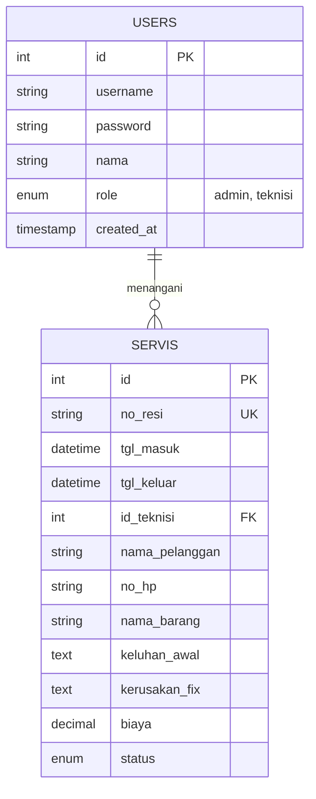

# Kelompok 14 - FixTrack

## Anggota Kelompok
1. **Friskila Rohasina Simarmata** (2315061043)
2. **Anggi Permata Sari** (2315061044)
3. **Intan Eka Safitri** (2315061064)
4. **Riski Jaya Putra** (2315061065)

## Judul Project
**Sistem Informasi Tracking Servis Alat (FixTrack)**

## Deskripsi Project
Aplikasi berbasis web untuk mengelola operasional bengkel perbaikan elektronik (HP, Laptop, TV, dll). Sistem ini mendigitalkan pencatatan barang masuk, memudahkan teknisi mengupdate status perbaikan, dan memungkinkan pelanggan memantau progress servis secara mandiri (self-service) tanpa harus login.

## Teknologi yang Digunakan
- **Frontend**: HTML5, Tailwind CSS (CDN), JavaScript Native
- **Backend**: PHP Native
- **Database**: MySQL

## Cara Menjalankan Aplikasi
1. **Persiapan Database**:
   - Buka phpMyAdmin (http://localhost/phpmyadmin).
   - Buat database baru dengan nama `fixtrack`.
   - Import file `database/database.sql` ke dalam database `fixtrack`.

2. **Konfigurasi Project**:
   - Pastikan folder project berada di dalam `htdocs`.
   - Struktur folder yang benar: `htdocs/tubes_pw/kelompok/kelompok_14/`.

3. **Menjalankan Website**:
   - Buka browser dan akses URL:
     ```
     http://localhost/tubes_pw/kelompok/kelompok_14/src/login.php
     ```
   - Login default:
     - **Admin**: Username `admin`, Password `admin123`
     - **Teknisi**: Username `teknisi`, Password `teknisi123`

## Struktur Database (ERD)

